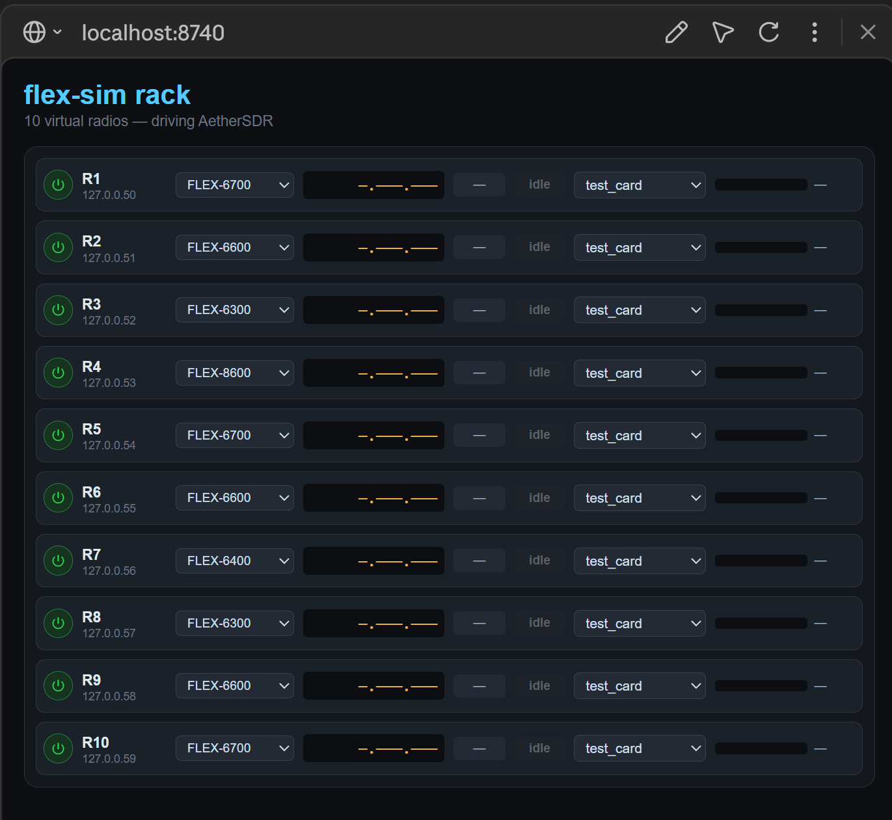

# flex-sim

A **synthetic FlexRadio-6000 emulator** for testing [AetherSDR](https://github.com/aethersdr/AetherSDR) — a hardware-free spectrum / waterfall / S-meter / CW test "radio" you drive from your browser.

flex-sim looks like a real FlexRadio 6000 on your network: AetherSDR discovers it, connects, and renders a live panadapter, waterfall, S-meter, TX meters and CW from a programmable signal engine. **No radio required.**

> Pure **Python 3.8+ standard library** — zero dependencies. **GPL-3.0**.

---

## Quick start — no Python, no command line

1. **Download the binary** for your computer from the **[Releases page](https://github.com/nigelfenton/flex-sim/releases/latest)**:
   - **Windows:** `flex-sim-windows-x64.exe`
   - **Linux:** `flex-sim-linux-x64`
   - **macOS:** `flex-sim-macos-arm64`
2. **Run it on a computer that is *not* running AetherSDR** — a spare PC, a Raspberry Pi, a NUC, a VM… anything on the same network. *(Why not the same computer? It's one simple rule — see [Networking](#networking--the-one-rule). You can run it on the same machine, it just needs a couple of extra steps.)*
   - **Windows:** double-click `flex-sim-windows-x64.exe`. It isn't code-signed, so Windows SmartScreen says *"unrecognized app"* (**More info → Run anyway**) and some antivirus (Norton, Defender) may flag or quarantine it — see the false-positive note below.
   - **Linux / macOS:** `chmod +x flex-sim-linux-x64 && ./flex-sim-linux-x64`

> **"My antivirus flagged it!"** That's an expected **false positive**, not malware. PyInstaller bundles the Python interpreter into one `.exe`, and that packing trips AV heuristics — it happens to most PyInstaller apps. flex-sim is **pure-stdlib Python with zero dependencies and the entire source (~1000 lines) is right here in this repo**, so you can read it or [run it straight from Python](#run-from-python-any-os-no-install) and skip the binary (and the warning) entirely. To use the binary anyway, restore/allow it in your AV.
3. **Open AetherSDR.** It should list a radio — model **FLEX-6600**, serial **FLEXSIM00**. Select it and connect.
4. **Open the control panel** at the address flex-sim prints on startup — `http://<that-computer-ip>:8731/` — and pick a test pattern. You should see a live waterfall and S-meter.

**If AetherSDR doesn't find it**, tell flex-sim where AetherSDR is so it can announce itself directly:
```
flex-sim-windows-x64.exe --ae 192.168.1.50      # <- the IP of the PC running AetherSDR
```

---

## Networking — the one rule

flex-sim is a **pretend radio on your network**, so **it needs its own IP address, separate from the computer running AetherSDR.** (They both use network port 4992 — on a single IP they'd collide.)

- **Easiest — run it on a different computer** on the same network (spare PC, Raspberry Pi, NUC, VM). It gets its own IP automatically and AetherSDR finds it just like a real radio. Nothing else to set up. **Most people should do this.**
- **Want it on the *same* computer as AetherSDR?** It still needs its own IP, which Windows won't hand a second program directly. Two ways:
  - **WSL (recommended on Windows):** run flex-sim inside Windows Subsystem for Linux — WSL gives it its own IP. See [Same-machine setup](#same-machine-setup-wsl) below. *(This is the proven path.)*
  - **`--port`:** `flex-sim --port 5992 --ae <AE-ip>` keeps it on the same IP but moves it off AetherSDR's port 4992.

Adding **`--ae <AetherSDR-IP>`** is always worth it — it makes flex-sim announce itself straight to AetherSDR (helps when network broadcast doesn't reach, or across subnets).

---

## Run from Python (any OS, no install)
```
python3 flex_sim.py --ae <AetherSDR-IP>
```
On Windows use `python` if that's how Python is installed. Handy flags: `--pattern carrier` · `--ctl-port 8731` · `--version` · `-h`.

## Many radios at once (rack mode)
```
python3 flex_sim.py --radios 3 --models FLEX-6300,FLEX-6600,FLEX-6700 --ae <AE-IP>
```
Runs N virtual radios that AetherSDR sees as separate rigs — a hardware-free multi-radio bench. Each gets its **own IP** (the `--ip` base, then +1, +2 …), serial (`FLEXSIM00…`), and model from `--models` (cycled). Models differ in capacity — **6300/6400/8400 = 2 slices / 1 SCU, 6500 = 4 / 1, 6600/8600 = 4 / 2, 6700 = 8 / 2** — so a mixed rack tests single- vs multi-MCU side by side, with up to the model's slice count of stacked receivers each. On **one host** the extra IPs must exist on the interface first (real rigs each have their own) — see [Same-machine setup](#same-machine-setup-wsl).



The web rack panel (`http://<flex-sim-ip>:<ctl-port>/`) shows every radio as a "1U strip" — power toggle, model selector, frequency/meter readouts, and a live pattern picker — so you can power-cycle or re-model any radio without restarting. The shot above is a 10-radio rack started with:
```
python3 flex_sim.py --radios 10 \
  --models FLEX-6700,FLEX-6600,FLEX-6300,FLEX-8600,FLEX-6700,FLEX-6600,FLEX-6400,FLEX-6300,FLEX-6600,FLEX-6700 \
  --pattern test_card --ctl-port 8740 --ae <AE-IP>
```

## Control panel
`http://<flex-sim-ip>:8731/` — pick a pattern (the hint box says what it exercises in AetherSDR), set the noise floor / signal level in **dBm (with S-units)**, signal width and noise colour; key **TX** (forward-power + SWR meters); send **CW** (normal / full break-in, driven from AetherSDR's own CWX keyer). Scroll down for the **[HF noise bench](#hf-noise-bench--test-aethersdrs-noise-reduction)** (live noise for testing noise reduction).

## Patterns
`noise_floor` · `ramp` · `staircase` · `carrier` · `swept_carrier` · `comb` · `cal_tones` · `two_tone` · `noise_cal` · `test_card` · `noise` · `ssb` · `cw` · `step` · `impulse` · `tx_blank`. The panel's hint box explains what each one exercises. (See also the **[HF noise bench](#hf-noise-bench--test-aethersdrs-noise-reduction)** for layered live noise, separate from these single patterns.)

## HF noise bench — test AetherSDR's noise reduction
A **live audio mixer** that feeds AetherSDR the RX audio its noise reduction actually
processes, so you can hear NR2 / RN2 / NR4 / DFNR / BNR (and the noise blanker) work
against realistic HF noise — and **see** it on the waterfall.

Open the control panel and scroll to **HF Noise Bench**. Each channel has an on/off
toggle and a level slider (dB); some add a knob. Turn on any combination — they mix
**additively**, and the waterfall shows the same scene you hear (zoom AetherSDR in to a
few kHz to see the tones spread at their true frequencies).

- **Noise** (all generated live, never a recording): `white`, `pink` (band hiss),
  `qrn` (lightning-impulse crackle), `powerline` (mains buzz), `crashes` (static
  bursts), `birdie` (carrier heterodyne), `hash` (switching-supply), `woodpecker`.
- **Wanted signal** (what NR should preserve): `cw` (a keyed tone) and `voice`.
- **Scene presets** (one click): `quiet-20m`, `night-40m`, `storm`, `noisy-qth`,
  `birdie-hell`, `voice-in-noise`, `cw-in-noise` — plus **All off**.

**Try it:** load `storm`, then toggle **NR2** in AetherSDR — the hiss drops. Load a
single `birdie`, place a **waterfall notch (TNF)** on it — the line *and* the tone
vanish. Load `voice-in-noise` and compare **RN2** (voice-tuned) vs NR2 on speech.

**Voice needs a WAV.** The `voice` channel plays an audio file (the noise is
synthesised). Make one from any text with the bundled tool, then point the bench at it:
```
python tools/make_voice_wav.py --text "The birch canoe slid on the smooth planks." --out fixtures/voice.wav
# panel: paste the path in the WAV box, or:
#   http://<ip>:8731/set?noise_voice=1&noise_voice_wav=<abs path to voice.wav>
```
The tool uses Windows SAPI text-to-speech (Windows only; on other OSes supply your own
WAV). Whatever text you choose stays on your machine — generated WAVs are gitignored.

**Every control is also an HTTP hook** (drive it from a script or an AI agent):
`/set?noise_<chan>=1|0`, `_level=<dB>`, `_<knob>=<val>`, `noise_preset=<name>`,
`noise_reset=1`; `/state` returns the full mixer snapshot.

> Same-machine tip: run the sim on a non-standard port (`--port 5992`) so it doesn't
> clash with AetherSDR's `4992`, and connect from AetherSDR's **radio list** (not
> "Connect by IP", which assumes port 4992).

## Offline self-test
```
python3 loopback_test.py carrier      # mock-AetherSDR: handshake + VITA + meter checks, no real AE
```

---

## Same-machine setup (WSL)

Running flex-sim on the **same Windows PC** as AetherSDR, via WSL2 (which gives it its own IP, so no port clash):

1. Put this in `%USERPROFILE%\.wslconfig` so WSL's `:4992` doesn't relay onto Windows:
   ```ini
   [wsl2]
   localhostForwarding=false
   ```
2. In WSL: `python3 flex_sim.py --ae <Windows-host-IP-as-seen-from-WSL>` (usually the default gateway, e.g. `172.x.x.1`).
3. AetherSDR (on Windows) discovers flex-sim at WSL's own IP (e.g. `172.x.x.x`).

For **rack mode on one host**, add the extra IPs to the interface first (one per extra radio):
```bash
sudo ip addr add 172.17.189.199/20 dev eth0   # radio 2
sudo ip addr add 172.17.189.200/20 dev eth0   # radio 3
```
(These are cleared when WSL restarts — re-add them after a reboot.)

## Docker
On **Linux**, a `macvlan` network gives the container its own LAN IP (clean — see `docker-compose.yml`). On **Docker Desktop for Windows/Mac**, containers aren't reachable at their own IP from the host, so Docker does **not** solve the same-machine case there — use WSL. Docker is for a **separate Linux box**.

## Build the binary yourself
The Releases binaries are built by GitHub Actions ([`.github/workflows/build.yml`](.github/workflows/build.yml)). To build locally:
```
pip install pyinstaller
pyinstaller --onefile --name flex-sim flex_sim.py    # -> dist/flex-sim(.exe)
```

---

## License
**GPL-3.0-or-later** — see [`LICENSE`](LICENSE) (matches AetherSDR's license).

## Credits
Created by **Nigel Fenton (G0JKN)** — design, direction, and testing against live AetherSDR. Code generated by **Claude (Anthropic)** via Claude Code under Nigel's direction — the same AI-assisted, human-reviewed workflow AetherSDR itself uses.

> Status: **v0.1 (beta).** Wire format reverse-engineered from AetherSDR's own decoder — see [`PROTOCOL.md`](PROTOCOL.md). Design notes in [`DESIGN.md`](DESIGN.md).
