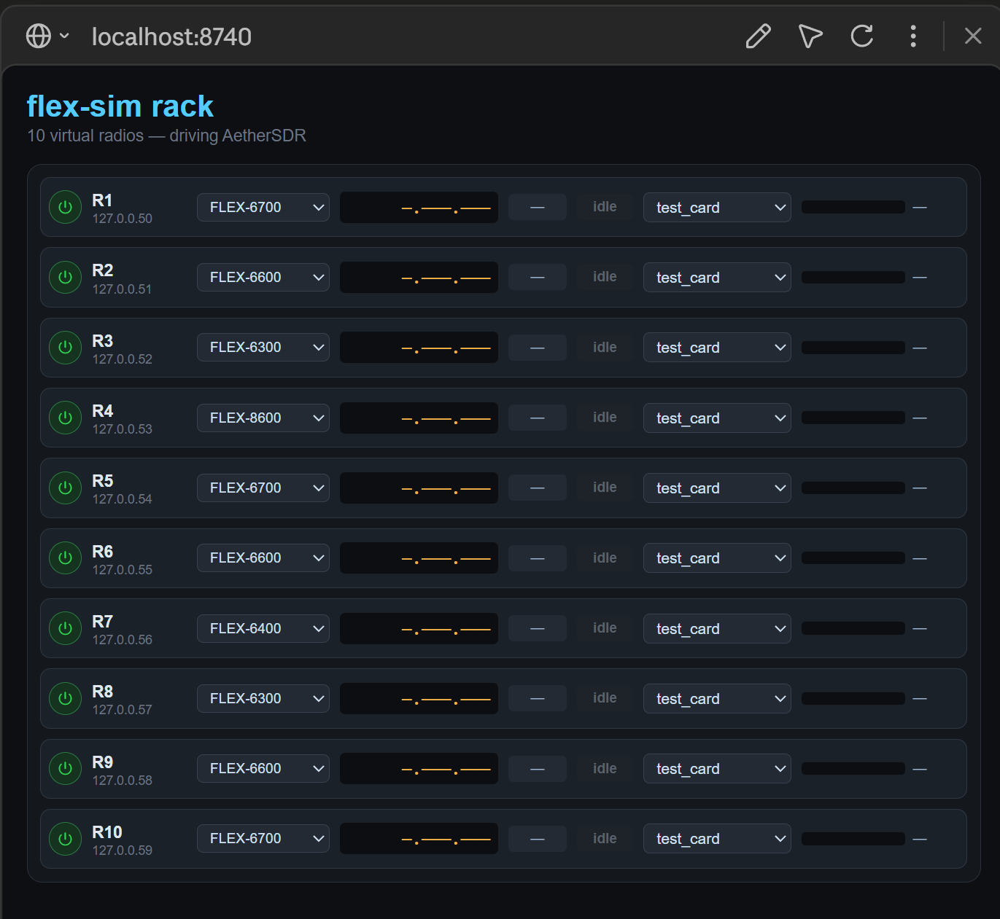

# flex-sim

A **synthetic FlexRadio-6000 emulator** for testing [AetherSDR](https://github.com/aethersdr/AetherSDR) — a hardware-free spectrum / waterfall / S-meter / CW test "radio" you drive from your browser.

flex-sim looks like a real FlexRadio 6000 on your network: AetherSDR discovers it, connects, and renders a live panadapter, waterfall, S-meter, TX meters and CW from a programmable signal engine. **No radio required.**

It also ships **`anan_sim.py`**, an **Apache Labs ANAN-G2 / openHPSDR Protocol 2** receiver simulator, and **`p2verify.py`**, which checks a real Protocol 2 radio's wire from a capture — see [ANAN / openHPSDR Protocol 2](#anan--openhpsdr-protocol-2-simulator).

> Pure **Python 3.8+ standard library** — zero dependencies. **GPL-3.0**.

---

## Quick start — no Python, no command line

1. **Download the binary** for your computer from the **[Releases page](https://github.com/nigelfenton/flex-sim/releases/latest)**:
   - **Windows:** `flex-sim-windows-x64.exe`
   - **Linux:** `flex-sim-linux-x64`
   - **macOS:** `flex-sim-macos-arm64`

   *(The binaries are the Flex radio sim. The ANAN / Protocol 2 tools and the accessory simulators run from source — see [Run from Python](#run-from-python-any-os-no-install).)*
2. **Run it on a computer that is *not* running AetherSDR** — a spare PC, a Raspberry Pi, a NUC, a VM… anything on the same network. *(Why not the same computer? It's one simple rule — see [Networking](#networking--the-one-rule). You can run it on the same machine, it just needs a couple of extra steps.)*
   - **Windows:** double-click `flex-sim-windows-x64.exe`. It isn't code-signed, so Windows SmartScreen says *"unrecognized app"* (**More info → Run anyway**) and some antivirus (Norton, Defender) may flag or quarantine it — see the false-positive note below.
   - **Linux / macOS:** `chmod +x flex-sim-linux-x64 && ./flex-sim-linux-x64`

> **"My antivirus flagged it!"** That's an expected **false positive**, not malware. PyInstaller bundles the Python interpreter into one `.exe`, and that packing trips AV heuristics — it happens to most PyInstaller apps. flex-sim is **pure-stdlib Python with zero dependencies and the entire source (~1000 lines) is right here in this repo**, so you can read it or [run it straight from Python](#run-from-python-any-os-no-install) and skip the binary (and the warning) entirely. To use the binary anyway, restore/allow it in your AV.
3. **Open AetherSDR.** It should list a radio — model **FLEX-6600**, serial **FLEXSIM00**. Select it and connect.
4. **Open the control panel** at the address flex-sim prints on startup — `http://<that-computer-ip>:8731/` — and pick a test pattern. You should see a live waterfall and S-meter.

**If AetherSDR doesn't find it**, tell flex-sim where AetherSDR is so it can announce itself directly:
```
flex-sim-windows-x64.exe --ae 192.168.1.50      # <- the IP of the PC running AetherSDR
```

---

## Networking — the one rule

flex-sim is a **pretend radio on your network**, so **it needs its own IP address, separate from the computer running AetherSDR.** (They both use network port 4992 — on a single IP they'd collide.)

- **Easiest — run it on a different computer** on the same network (spare PC, Raspberry Pi, NUC, VM). It gets its own IP automatically and AetherSDR finds it just like a real radio. Nothing else to set up. **Most people should do this.**
- **Want it on the *same* computer as AetherSDR?** It still needs its own IP, which Windows won't hand a second program directly. Two ways:
  - **WSL (recommended on Windows):** run flex-sim inside Windows Subsystem for Linux — WSL gives it its own IP. See [Same-machine setup](#same-machine-setup-wsl) below. *(This is the proven path.)*
  - **`--port`:** `flex-sim --port 5992 --ae <AE-ip>` keeps it on the same IP but moves it off AetherSDR's port 4992.

Adding **`--ae <AetherSDR-IP>`** is always worth it — it makes flex-sim announce itself straight to AetherSDR (helps when network broadcast doesn't reach, or across subnets).

---

## Run from Python (any OS, no install)
```
python3 flex_sim.py --ae <AetherSDR-IP>
```
On Windows use `python` if that's how Python is installed. Handy flags: `--pattern carrier` · `--ctl-port 8731` · `--version` · `-h`.

## Many radios at once (rack mode)
```
python3 flex_sim.py --radios 3 --models FLEX-6300,FLEX-6600,FLEX-6700 --ae <AE-IP>
```
Runs N virtual radios that AetherSDR sees as separate rigs — a hardware-free multi-radio bench. Each gets its **own IP** (the `--ip` base, then +1, +2 …), serial (`FLEXSIM00…`), and model from `--models` (cycled). Models differ in capacity — **6300/6400/8400 = 2 slices / 1 SCU, 6500 = 4 / 1, 6600/8600 = 4 / 2, 6700 = 8 / 2** — so a mixed rack tests single- vs multi-MCU side by side, with up to the model's slice count of stacked receivers each. On **one host** the extra IPs must exist on the interface first (real rigs each have their own) — see [Same-machine setup](#same-machine-setup-wsl).



The web rack panel (`http://<flex-sim-ip>:<ctl-port>/`) shows every radio as a "1U strip" — power toggle, model selector, frequency/meter readouts, and a live pattern picker — so you can power-cycle or re-model any radio without restarting. The shot above is a 10-radio rack started with:
```
python3 flex_sim.py --radios 10 \
  --models FLEX-6700,FLEX-6600,FLEX-6300,FLEX-8600,FLEX-6700,FLEX-6600,FLEX-6400,FLEX-6300,FLEX-6600,FLEX-6700 \
  --pattern test_card --ctl-port 8740 --ae <AE-IP>
```

## Control panel
`http://<flex-sim-ip>:8731/` — pick a pattern (the hint box says what it exercises in AetherSDR), set the noise floor / signal level in **dBm (with S-units)**, signal width and noise colour; key **TX** (forward-power + SWR meters); send **CW** (normal / full break-in, driven from AetherSDR's own CWX keyer). Scroll down for the **[HF noise bench](#hf-noise-bench--test-aethersdrs-noise-reduction)** (live noise for testing noise reduction).

## Patterns
`noise_floor` · `ramp` · `staircase` · `carrier` · `swept_carrier` · `comb` · `cal_tones` · `two_tone` · `noise_cal` · `test_card` · `noise` · `ssb` · `cw` · `step` · `impulse` · `tx_blank`. The panel's hint box explains what each one exercises. (See also the **[HF noise bench](#hf-noise-bench--test-aethersdrs-noise-reduction)** for layered live noise, separate from these single patterns.)

## HF noise bench — test AetherSDR's noise reduction
A **live audio mixer** that feeds AetherSDR the RX audio its noise reduction actually
processes, so you can hear NR2 / RN2 / NR4 / DFNR / BNR (and the noise blanker) work
against realistic HF noise — and **see** it on the waterfall.

Open the control panel and scroll to **HF Noise Bench**. Each channel has an on/off
toggle and a level slider (dB); some add a knob. Turn on any combination — they mix
**additively**, and the waterfall shows the same scene you hear (zoom AetherSDR in to a
few kHz to see the tones spread at their true frequencies).

- **Noise** (all generated live, never a recording): `white`, `pink` (band hiss),
  `qrn` (lightning-impulse crackle), `powerline` (mains buzz), `crashes` (static
  bursts), `birdie` (carrier heterodyne), `hash` (switching-supply), `woodpecker`.
- **Wanted signal** (what NR should preserve): `cw` (a keyed tone) and `voice`.
- **Scene presets** (one click): `quiet-20m`, `night-40m`, `storm`, `noisy-qth`,
  `birdie-hell`, `voice-in-noise`, `cw-in-noise` — plus **All off**.

**Try it:** load `storm`, then toggle **NR2** in AetherSDR — the hiss drops. Load a
single `birdie`, place a **waterfall notch (TNF)** on it — the line *and* the tone
vanish. Load `voice-in-noise` and compare **RN2** (voice-tuned) vs NR2 on speech.

**Voice needs a WAV.** The `voice` channel plays an audio file (the noise is
synthesised). Make one from any text with the bundled tool, then point the bench at it:
```
python tools/make_voice_wav.py --text "The birch canoe slid on the smooth planks." --out fixtures/voice.wav
# panel: paste the path in the WAV box, or:
#   http://<ip>:8731/set?noise_voice=1&noise_voice_wav=<abs path to voice.wav>
```
The tool uses Windows SAPI text-to-speech (Windows only; on other OSes supply your own
WAV). Whatever text you choose stays on your machine — generated WAVs are gitignored.

**Every control is also an HTTP hook** (drive it from a script or an AI agent):
`/set?noise_<chan>=1|0`, `_level=<dB>`, `_<knob>=<val>`, `noise_preset=<name>`,
`noise_reset=1`; `/state` returns the full mixer snapshot.

> Same-machine tip: run the sim on a non-standard port (`--port 5992`) so it doesn't
> clash with AetherSDR's `4992`, and connect from AetherSDR's **radio list** (not
> "Connect by IP", which assumes port 4992).

## Offline self-test
```
python3 loopback_test.py carrier      # mock-AetherSDR: handshake + VITA + meter checks, no real AE
```

## Accessory simulators — a whole station, no hardware

Alongside the radio, flex-sim ships standalone simulators for the station accessories
AetherSDR can control, each a single pure-stdlib file with its own interactive prompt
(`--no-cli` for headless, `-h` for flags):

| Sim | Device | Port | Discovery in AetherSDR |
|---|---|---|---|
| `ag_sim.py` | 4O3A Antenna Genius (switch) | 9007 | auto (UDP beacon) |
| `pgxl_sim.py` | 4O3A Power Genius XL (amp) | 9008 | manual IP (Peripherals tab) |
| `tgxl_sim.py` | 4O3A Tuner Genius XL (tuner) | 9010 | manual IP (Peripherals tab) |
| `spe_sim.py` | SPE Expert 1.3K/1.5K/2K (amp) | 4531 | manual IP (Network mode) |
| `acom_sim.py` | ACOM 600S/700S/1200S (amp) | 9600 | manual IP |
| `kpa_sim.py` | Elecraft KPA1500 (amp), with network PTT | 1500 TCP+UDP | none yet — AetherSDR has no KPA1500 support ([#4097](https://github.com/aethersdr/AetherSDR/issues/4097)) |

**`station.py` runs them all in one process** with one prompt to drive them — key an
amp, step the tuner relays, switch antennas — so meters and relays actually move in
AetherSDR instead of sitting at headless defaults:
```
python3 station.py                    # all six accessories + unified prompt
python3 station.py --with-radio       # also spawn flex_sim.py (the radio)
python3 station.py --no-cli           # headless (staged/background)
```
It prints a connect table with the exact host:port to enter in AetherSDR for each device.

### KPA1500: a bench for network PTT and T/R interlocks

`kpa_sim.py` is the only accessory sim that **transmits**. KPA1500 firmware 3.07 can be keyed
over the network (`^TX;` / `^TXnn;` / `^RX;` / `^TQ;`), and the reference warns that the amp
needs **about 5 ms of key lead before exciter RF arrives**, and that RF must be gone before
`^RX;`. The sim models the T/R relays and logs a **HOT SWITCH** whenever they move with RF on
them: RF that arrives before the key, RF sooner than 5 ms after it, or a drop to RX
(`^RX`, a `^TXnn` watchdog expiry, a fault, STBY) while the exciter is still on. Every edge is
timestamped, with the measured lead and tail, so a controller's sequencing is *measured*.

```
python3 kpa_sim.py                            # :1500 TCP+UDP, control page :8737, RF sense :1510
python3 flex_sim.py --rf-sense 127.0.0.1:1510 # the radio tells the amp when its RF is on
python3 station.py --with-radio               # both, wired together
```

Open `http://<host>:8737/` for live meters, keying, fault injection and the event log, or
`GET /state`, `/events?since=N` and `/cmd?c=<command>` from a script. Built against the
Elecraft KPA1500 Programming Reference V3; the file's header lists exactly where the sim
follows the reference and where it has to guess.

---

## ANAN / openHPSDR Protocol 2 simulator

`anan_sim.py` simulates a **different radio family**: an Apache Labs **ANAN-G2
(Saturn)** speaking **openHPSDR Protocol 2**. It answers discovery, completes the
General → DDC-Specific → DUC-Specific → High-Priority handshake, and streams DDC I/Q
at the sample rate the client commands — enough for a Protocol 2 client to find the
radio and paint a panadapter and waterfall. Pure standard library, like the rest.

It exists so Protocol 2 client work can be developed and reviewed **without a radio on
the bench** — including AetherSDR's own ANAN-G2 backend
([aethersdr/AetherSDR#5143](https://github.com/aethersdr/AetherSDR/pull/5143), designed in
[RFC #4970](https://github.com/aethersdr/AetherSDR/issues/4970)).

```
python3 anan_sim.py                           # 48 k, test tone, autodetected interface
python3 anan_sim.py --rate 96000 --pattern noise
python3 anan_sim.py --ip 10.0.0.5             # bind a specific interface
```

Then point a Protocol 2 client — Thetis, piHPSDR, NereusSDR, AetherSDR's ANAN backend —
at that host. As with the Flex sim, a **separate machine or IP** is the simple path.

**Receive only.** Not implemented: transmit (DUC), wideband ADC streams, mic samples,
memory-mapped access, and acting on a non-default port re-assignment (accepted and
logged, not honoured).

**How it has been checked** — deliberately not only against itself, because the sim,
its tests and the probe below all derive from the same documentation and could agree
while all being wrong:

| Check | What it established |
|---|---|
| Real ANAN-G2 captures, read by `p2verify.py` | RX frames are **16 B header + 1428 B = 238 samples** at every rate. The widely-quoted 1440 B / 240-sample figure is the **TX** layout ([#3](https://github.com/nigelfenton/flex-sim/pull/3)) |
| NereusSDR 0.5.2, end to end | discovery, session-port handling, enabled-DDC streaming, re-rating and RX rendering interoperate — and it exposed four sim defects the shared-ancestry checks could not ([#5](https://github.com/nigelfenton/flex-sim/issues/5)) |
| `tools/p2stream.c` | an independent probe whose send and parse offsets come from piHPSDR, not from this sim |
| AetherSDR's ANAN-G2 backend, end to end (2026-09-16) | discovery, session and streaming interoperate — and it exposed that the sim's **I/Q handedness was mirrored**: the "+1 kHz" tone drew 1 kHz *below* the dial and was audible only in LSB. AE's polarity had been measured on a real G2 and cross-checked with an RSP1B, so the sim was the one in error. Fixed in v0.3.1 |
| `tests/test_anan_p2.py` | the wire bytes **and the tone's handedness**, asserted in CI on Linux and Windows |

**I/Q handedness.** Like a real HPSDR radio, the sim's wire I/Q is the conjugate of the
textbook convention: a signal *above* the dial arrives at a *negative* frequency. A
correct client shows the default tone just **above** the tuned frequency and hears it in
**USB**. If you see it below the dial and hear it only in LSB, the client — or a sim
older than v0.3.1 — has I/Q the wrong way round.

One observation is still open: an RX-audio click comb seen in NereusSDR while the wire
itself was clean, with its attribution deliberately left unresolved
([#5](https://github.com/nigelfenton/flex-sim/issues/5)).

```
python3 -m pytest tests/test_anan_p2.py                      # spawns its own sim on loopback
cc -O2 -o p2stream tools/p2stream.c && ./p2stream 127.0.0.1  # POSIX: Linux / macOS / WSL
```

### Checking a real radio's wire — `p2verify.py`

A standard-library pcapng reader that reports what a real Protocol 2 radio actually
puts on the wire: the discovery reply, every P2 flow with its rate, and whether each
1444 B stream is **DDC (RX)** or **DUC (TX)** — decided by the frame's own declared
fields, never by port number. It also flags all-zero transmit payloads, which are
useless as a modulation reference.

```
python3 p2verify.py session.pcapng [--radio-ip A.B.C.D] [--limit N]
```

It guards against the two traps that made earlier readings wrong:

- **pcapng timestamps can be nanoseconds, not microseconds.** Resolution is declared
  per interface; assuming the default makes every cadence 1000× too slow.
- **Unrelated multicast (RTP, PTP) can share the wire** and bury the P2 session in a
  top-N summary. Only traffic in the P2 port range is reported, and multicast and
  broadcast are dropped except for discovery packets.

The reference captures it was verified against are recordings of a private station and
are not distributed; point it at your own capture. `tests/test_p2verify.py` exercises it
on a synthetic capture built to trip both traps.

---

## Same-machine setup (WSL)

Running flex-sim on the **same Windows PC** as AetherSDR, via WSL2 (which gives it its own IP, so no port clash):

1. Put this in `%USERPROFILE%\.wslconfig` so WSL's `:4992` doesn't relay onto Windows:
   ```ini
   [wsl2]
   localhostForwarding=false
   ```
2. In WSL: `python3 flex_sim.py --ae <Windows-host-IP-as-seen-from-WSL>` (usually the default gateway, e.g. `172.x.x.1`).
3. AetherSDR (on Windows) discovers flex-sim at WSL's own IP (e.g. `172.x.x.x`).

For **rack mode on one host**, add the extra IPs to the interface first (one per extra radio):
```bash
sudo ip addr add 172.17.189.199/20 dev eth0   # radio 2
sudo ip addr add 172.17.189.200/20 dev eth0   # radio 3
```
(These are cleared when WSL restarts — re-add them after a reboot.)

## Docker
On **Linux**, a `macvlan` network gives the container its own LAN IP (clean — see `docker-compose.yml`). On **Docker Desktop for Windows/Mac**, containers aren't reachable at their own IP from the host, so Docker does **not** solve the same-machine case there — use WSL. Docker is for a **separate Linux box**.

## Build the binary yourself
The Releases binaries are built by GitHub Actions ([`.github/workflows/build.yml`](.github/workflows/build.yml)). To build locally:
```
pip install pyinstaller
pyinstaller --onefile --name flex-sim flex_sim.py    # -> dist/flex-sim(.exe)
```

---

## License
**GPL-3.0-or-later** — see [`LICENSE`](LICENSE) (matches AetherSDR's license).

## Credits
Created by **Nigel Fenton (G0JKN)** — design, direction, and testing against live AetherSDR. Code generated by **Claude (Anthropic)** via Claude Code under Nigel's direction — the same AI-assisted, human-reviewed workflow AetherSDR itself uses.

Protocol 2 facts come from Laurence Barker's Saturn documentation and piHPSDR (both GPL-3.0; clean-room — facts consulted, no code copied), with the receive geometry confirmed against real ANAN-G2 captures from **N2JXL**.

> Status: **v0.3 (beta).** Wire format reverse-engineered from AetherSDR's own decoder — see [`PROTOCOL.md`](PROTOCOL.md). Design notes in [`DESIGN.md`](DESIGN.md).
